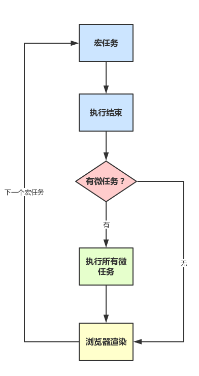

## 1.写 React / Vue 项目时为什么要在列表组件中写 key，其作用是什么？
 * 绑定key一定要唯一，这样在修改数据的时候才能驱动虚拟dom更新
 * 某些情况下不绑定key在修改数据后dom渲染的速度是比加key要快的(dom结构必须简单)，这种就是diff的<font color="red">就地复用</font>所以比加key要快
 * 一般是要加key，在vue里不加key只有黄字警告，但是在react的diff和vue的diff稍有区别，react循环渲染key是必须要加，不然在某一些情况下setState了数据视图没有更新
 
## 2.['1', '2', '3'].map(parseInt) 执行后是输出什么，为什么输出这个?

* map函数式回调形式返回参数一共有三个参数：value, index, array 当前值 当前下标 当前遍历的数组
* parentInt是内置函数一共有两个参数: string radix 需要转化成整形的值 需要返回的进制数
```js
  parseInt('1', 0); // 0 默认是10进制所以返回 1
  parseInt('2', 1); // 1 是1进制最大值为1 无法计算返回 NaN
  parseInt('3', 2); // 2 是2进制最大值为2 无法计算返回 NaN
```
* 所以答案是[1, NaN, NaN],不是['1', '2', '3']
## 3.什么是防抖和节流？有什么区别？如何实现？
* 防抖：动作绑定事件，动作发生后一定时间后触发事件，在这段时间内，如果该动作又发生，则重新等待一定时间再触发事件
```js
/**
* debounce
* @param {Function} fn
* @param {Number} delay
* @returns {Function}
*/
function debounce(fn, delay) {
  let timeout = null;
  return function() {
    clearTimeout(timeout)
    timeout = setTimeout(() => {
      fn.apply(this, arguments);
    }, delay)
  }
}
```
* 节流: 动作绑定事件，在规定时间内不管事件怎么触发，事件始终执行一次
```js
/**
* throtte
* @param fn
* @param time
* @returns {Function}
*/
function throtte(fn, time) {
  let activeTime = 0;
  return function() {
    const current = Date.now();
    if (current - activeTime > time) {
      fn.apply(this, arguments);
      activeTime = Date.now();
    }
  }
}
```

## 4.Set、Map、WeakSet 和 WeakMap 的区别？
* Set
  1. 成员不能重复
  2. 只有值，没有建名，类似数组
  3. 可以遍历，有add，delete，has, clear方法
* Map
  1. 是集合、字典可以储存不重复的值
  2. 集合石已[value1, value2]形式储存，字段是已[key, value]形式储存
* WeakSet
  1. 只能存储对象引用，不能存放值，Set是可以的
* WeakMap
  1. 是一种键值对的集合(null除外)，其中建是弱引用对象，而值可以是任意
  2. 不能遍历，有get, set, has, delete方法

## 5.深度优先遍历、广度优先遍历
* 深度优先遍历：假设某视图未被访问，则从某一个顶点v出发，依次访问下去直到访问不到为止，然后再访问另外一个未被访问的顶点v，依次执行下去。（其实就是多个tree递归的集合）
* 广度优先遍历：假设某视图未被访问，则从某一个顶点v出发访问完毕后再寻找另外一个顶点v直到找不到顶点v为止，然后在访问第一个访问过的顶点v的下级顶点，依次循环下去。(多个tree都先遍历顶部，遍历完所有tree的顶部，再遍历所有的下级，依次循环下去)

## 6.ES5/ES6 的继承除了写法以外还有什么区别？
* function声明变量会提升, class不会。
```js
const bar = new Bar(); // 这里不会报错，正常的new出来了
function Bar() {
  this.foo = 1;
}
```
```js
const bar = new Bar(); // bar is not defined;
class Bar {
  constructor() {
    this.foo = 1;
  }
}
```
* class声明会默认内部开启严格模式
* class所有方法都是不可枚举的
```js
function Bar() {
  this.foo = 1;
}
Bar.prototype.answer = function() {
  return 1314;
}
Object.keys(Bar.prototype) // ['answer']
```
```js
class Bar {
  constructor() {
    this.foo = 1;
  }
  static answer() {
    return 1314;
  }
}
Object.keys(Bar.prototype) // []
```
* class的所有方法没有原型prototype,不能用new调用
```js
function Bar() {
  this.foo = 1;
}
Bar.prototype.answer = function () {
  return 1314;
}
const bar = new Bar();
const answer = new bar.answer(); // 正常
```
```js
class Bar {
  constructor(){
    this.foo = 1;
  }
  answer() {
    return 1314;
  }
}
const bar = new Bar();
const answer = new bar.answer(); // 报错
```
* class使用前必须要new
* class内部不能重写类名
```js
function Bar() {
  Bar = 'Baz'; // 正常
  this.foo = 1;
}
```
```js
class Bar {
 constructor() {
   Bar = 'Baz'; // 报错
   this.foo = 1;
 }
}
Bar = 'Baz' // 正常
```

## 7.setTimeout、Promise、Async/Await 的区别
* 此题需要基础非常优秀，不然太容易混淆，我个人理解是宏观上的任务列队与微观任务列队的区别
* 例如经常会考的这样的题目问执行console的顺序
```js
console.log(1);
const promise = new Promise((resolve) => {
  console.log(2);
  resolve();
  console.log(3);
}).then(() => {
  console.log(4);
})
setTimeout(() => {
  console.log(5);
}, 0)
console.log(6)

/**
* 输出顺序 1 -> 2 -> 3 -> 6 -> 4 -> 5
**/
```
* 又例如关于async/await的
```js
async function function1() {
  console.log(2);
  await function2();
  console.log(3)
}
async function function2() {
  console.log(4);
}
console.log(1);
function1();
console.log(5);

/**
* 输出顺序 1 -> 2 -> 4 -> 5 -> 3
**/
```
* 4个混合使用 (头条面试题)
```js
async function async1() {
  console.log(1);
  await async2();
  console.log(2);
}

async function async2() {
  console.log(3);
}

console.log(4);

setTimeout(() =>{
  console.log(5)
}, 0);

async1();

new Promise((resolve) => {
  console.log(6);
  resolve();
}).then(() => {
  console.log(7);
});
console.log(8);

/**
* 输出顺序 4 -> 1 -> 3 -> 6 -> 8 -> 2 -> 7 -> 5
**/
```
* 在js中任务为同步任务和异步任务，不同任务在主线程上执行，而异步任务只要有了执行结果就会放入任务队列中，一旦主线程任务执行完，系统就会读取任务队列将异步任务添加到可执行任务队列中，开始执行。任务执行流程图如下:


* Promise异步是提现在then和catch的，所以在then之前的是同步执行的，await是等待而在任务队列里是让出一个线程的意思await后的同步任务会先执行，但是await的任务会在任务队列里去了

## 8.资源预加载，用于活动页面，游戏开始前加载
```js
/**
* 单张图片加载
* @param src
* @returns {Promise<any>}
*/
function loadImg(src='') {
  return new Promise((resolve, reject) => {
    const img = new Image();
    img.src = src;
    img.onload = () => {
      resolve(src)
    };
    img.onerror = () => {
      reject()
    }
  })
}
const imgArray = ['http://pic37.nipic.com/20140113/8800276_184927469000_2.png', 'http://pic25.nipic.com/20121205/10197997_003647426000_2.jpg', 'http://img.redocn.com/sheji/20141219/zhongguofengdaodeliyizhanbanzhijing_3744115.jpg', 'http://pic40.nipic.com/20140331/9469669_142840860000_2.jpg', 'http://pic39.nipic.com/20140321/18063302_210604412116_2.jpg'];
const imgLen = imgArray.length;
let loadSuccessCount = 0;
for (let i = 0; i < imgLen; i++) {
  loadImg(imgArray[i]).then(() => {
    loadSuccessCount++;
    console.log(`当前加载到${loadSuccessCount}张图片，当前进度${(loadSuccessCount / imgLen * 100).toFixed(2)}%`);
  });
}
```

## 9.

